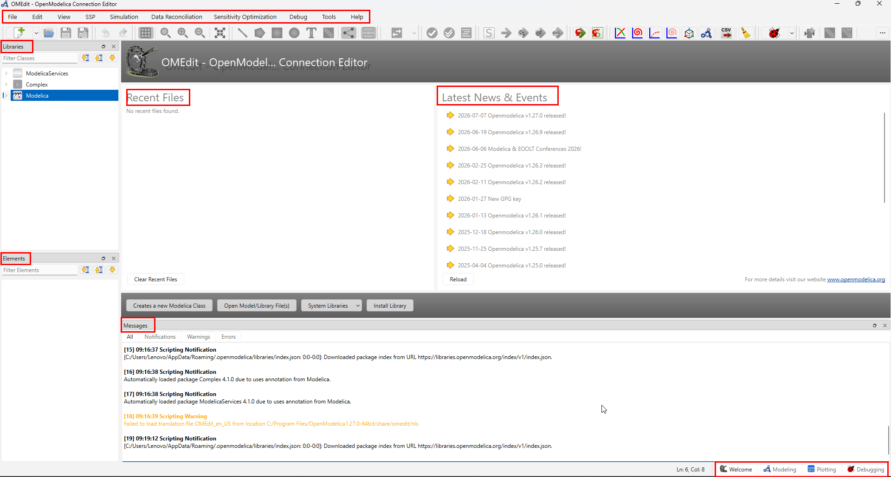
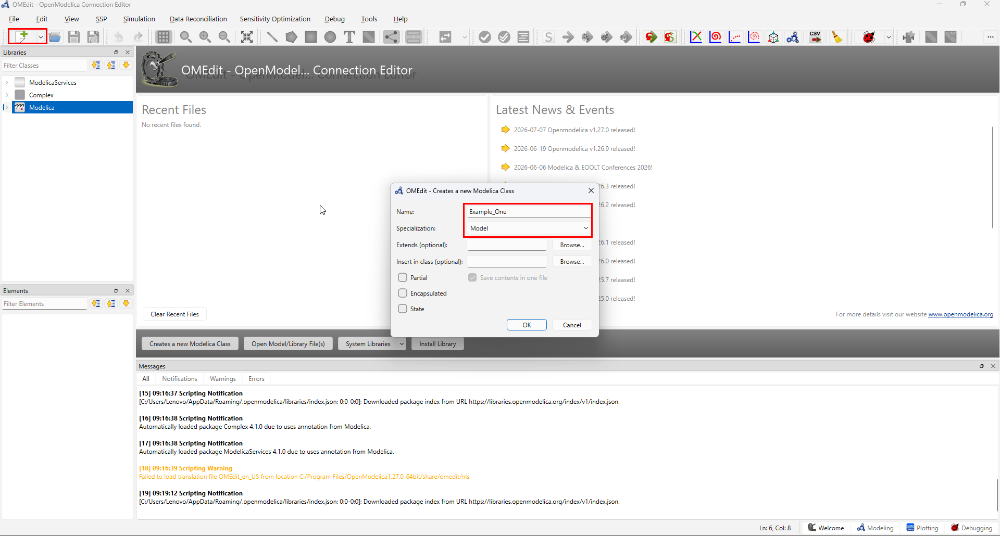
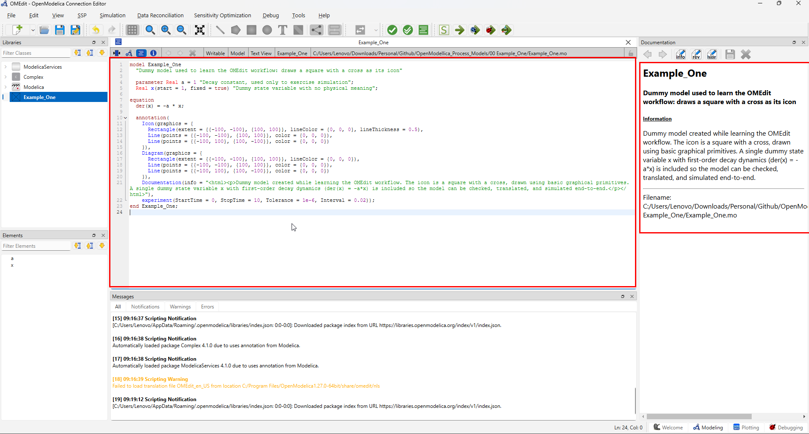
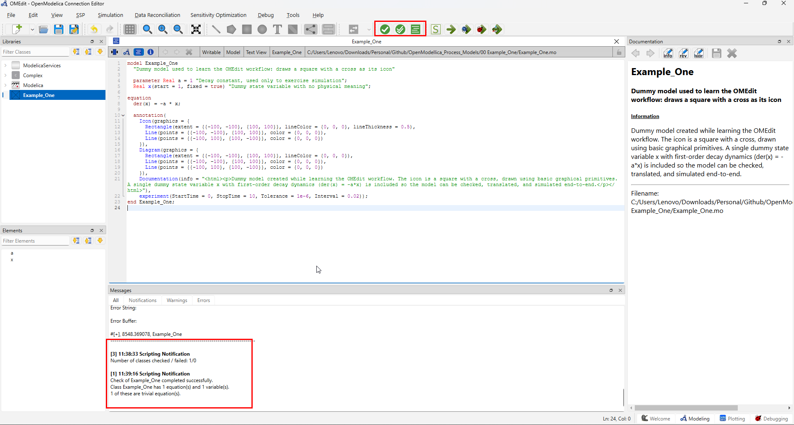
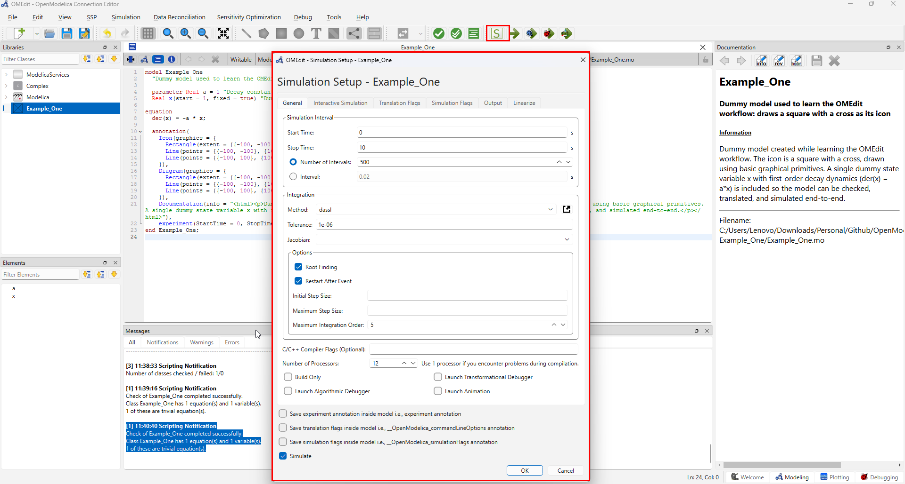
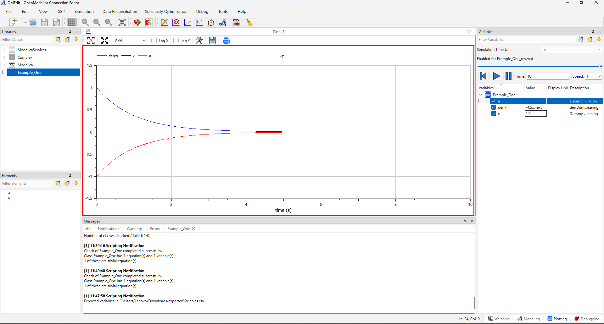

# Example One: Building a Dummy Model in OpenModelica

This document records the first model created while learning the OpenModelica
user interface and workflow. Add screenshots to the [`images`](./images/)
folder and replace the image placeholders below as the model develops.

## 1. Purpose and learning goals

The purpose of this example is to become familiar with:

- opening OpenModelica and navigating the OMEdit interface;
- creating a new Modelica model and organizing it in a package;
- adding components from the Modelica Standard Library;
- connecting components and checking connector compatibility;
- entering parameter values and initial conditions;
- translating, simulating, and inspecting the results; and
- documenting a model so that it can be reproduced later.

This is a learning example rather than a production-ready process model.

## 2. Model overview

### Model name

`<Enter the model name>`

### What the model represents

`<Briefly describe the physical or pseudo-process represented by the model.>`

### Inputs

| Input | Description | Value or unit |
| --- | --- | --- |
| `<input>` | `<what it controls>` | `<value>` |

### Outputs

| Output | Description | Value or unit |
| --- | --- | --- |
| `<output>` | `<what it measures>` | `<value>` |

### Main assumptions

1. `<Assumption 1>`
2. `<Assumption 2>`
3. `<Assumption 3>`

## 3. Software and project setup

Record the environment used for this example:

- **OpenModelica version:** `<version>`
- **OMEdit version:** `<version, if different>`
- **Operating system:** `<operating system>`
- **Date created:** `2026-08-28`
- **Modelica libraries used:** `<for example, Modelica Standard Library>`

### Starting OpenModelica

1. Open OMEdit.
2. Confirm that the required Modelica libraries are available.
3. Create or open the package that will contain this example.
4. Save the package in the project directory.



> Screenshot to add: capture the initial OMEdit workspace and save it as
> `images/01-omedit-workspace.png`.

## 4. Creating the model

1. Create a new **Model** (or the appropriate class type).
2. Name it `<model name>`.
3. Add a short description of its purpose.
4. Save the model inside the `00 Example_One` package.



> Screenshot to add: show the new model in the package browser and its empty
> diagram view. Save it as `images/02-create-model.png`.

## 5. Adding model components

Add the components required by the model. Components can be dragged from the
library browser into the diagram view or created from the component menu.

| Component | Library path | Purpose | Parameters to set |
| --- | --- | --- | --- |
| `<component>` | `<library path>` | `<purpose>` | `<parameters>` |
| `<component>` | `<library path>` | `<purpose>` | `<parameters>` |
| `<component>` | `<library path>` | `<purpose>` | `<parameters>` |

For each component:

1. Place it in the diagram.
2. Give it a meaningful instance name.
3. Open its parameter dialog.
4. Enter the required values and units.
5. Record any non-default settings in the table above.


> Screenshot to add: show all components before they are connected. Save it as
> `images/03-add-components.png`.

## 6. Connecting the components

Connect compatible ports in the direction required by the model:

1. Select the source connector.
2. Drag to the destination connector.
3. Confirm that the connection line is created.
4. Add a connection annotation or label if it improves readability.
5. Arrange the components so that the flow of the model is easy to follow.

Connections used in this model:

| Source | Destination | Meaning |
| --- | --- | --- |
| `<component.port>` | `<component.port>` | `<flow or signal meaning>` |
| `<component.port>` | `<component.port>` | `<flow or signal meaning>` |


> Screenshot to add: show the complete connected diagram. Save it as
> `images/04-connected-model.png`.

## 7. Reviewing the generated Modelica code

Switch to the **Text View** and review the code generated from the diagram.
Check that:

- the model and component names are correct;
- parameter values and units are present;
- all intended connections appear;
- no unexpected components or connections were added; and
- the `equation` section is consistent with the diagram.

Copy important observations here:

```modelica
// Paste the relevant generated Modelica code here.
```



> Screenshot to add: show the relevant Text View section. Save it as
> `images/05-generated-code.png`.

## 8. Checking and translating the model

Before simulating:

1. Save the model.
2. Run **Check Model** or **Check All Models**.
3. Read every warning and error.
4. Resolve connector, parameter, or initialization problems.
5. Translate the model once the check completes successfully.

Record the result:

- **Check result:** `<successful / warnings / errors>`
- **Translation result:** `<successful / failed>`
- **Important messages:** `<paste or summarize messages>`



> Screenshot to add: show the check or translation result. Save it as
> `images/06-model-check.png`.

## 9. Configuring and running the simulation

Use the simulation setup dialog to record the settings used:

| Setting | Value |
| --- | --- |
| Start time | `<value>` |
| Stop time | `<value>` |
| Number of intervals | `<value>` |
| Solver | `<solver>` |
| Tolerance | `<value>` |
| Output format | `<format>` |

Then:

1. Apply the simulation settings.
2. Start the simulation.
3. Confirm that it completes without errors.
4. Save the model and simulation result.



> Screenshot to add: show the simulation setup dialog. Save it as
> `images/07-simulation-setup.png`.

## 10. Reviewing simulation results

Select the variables that are relevant to the model and inspect their plots.
Record what each plot demonstrates.

| Variable | Expected behavior | Observed behavior |
| --- | --- | --- |
| `<variable>` | `<expectation>` | `<observation>` |
| `<variable>` | `<expectation>` | `<observation>` |



> Screenshot to add: show the main result plot and selected variables. Save it
> as `images/08-simulation-results.png`.

### Result interpretation

`<Explain whether the results match the expected behavior. Mention trends,
steady state, transients, or unexpected behavior.>`

## 11. Problems encountered and fixes

| Problem | Likely cause | Fix |
| --- | --- | --- |
| `<problem>` | `<cause>` | `<fix>` |
| `<problem>` | `<cause>` | `<fix>` |

## 12. Reproduction checklist

- [ ] Open the recorded OpenModelica version.
- [ ] Open the package containing the example.
- [ ] Confirm that all referenced libraries are available.
- [ ] Confirm component names and parameter values.
- [ ] Confirm all connections.
- [ ] Check and translate the model.
- [ ] Run the simulation with the recorded settings.
- [ ] Compare the results with the observations in this document.
- [ ] Add or update screenshots when the model changes.

## 13. Next steps

- Replace the dummy components with the intended process components.
- Add realistic parameters and units.
- Add validation cases and expected results.
- Improve the diagram layout and annotations.
- Document assumptions and limitations before reusing the model.
