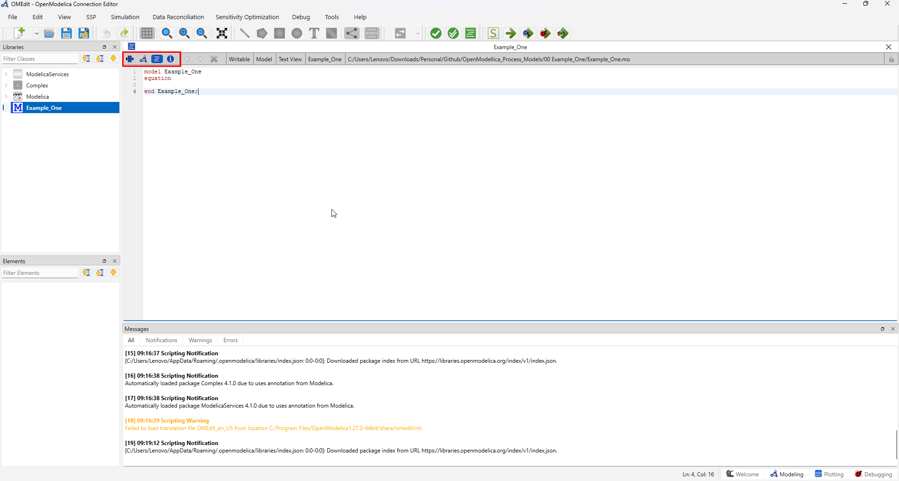
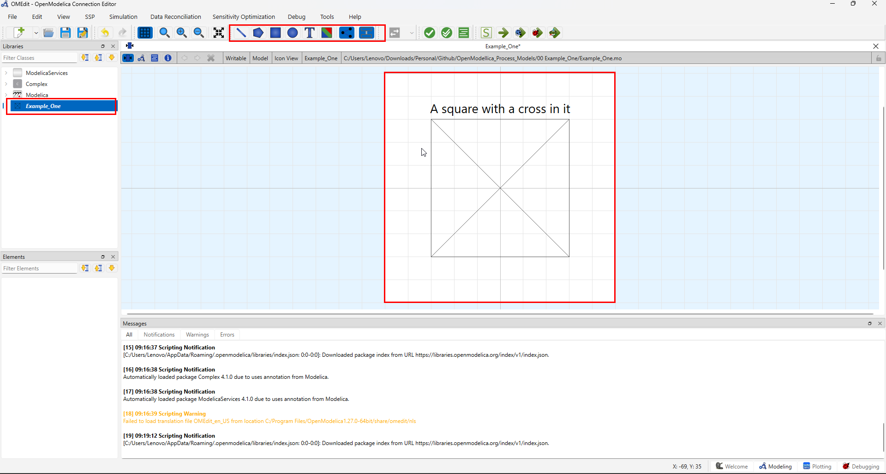
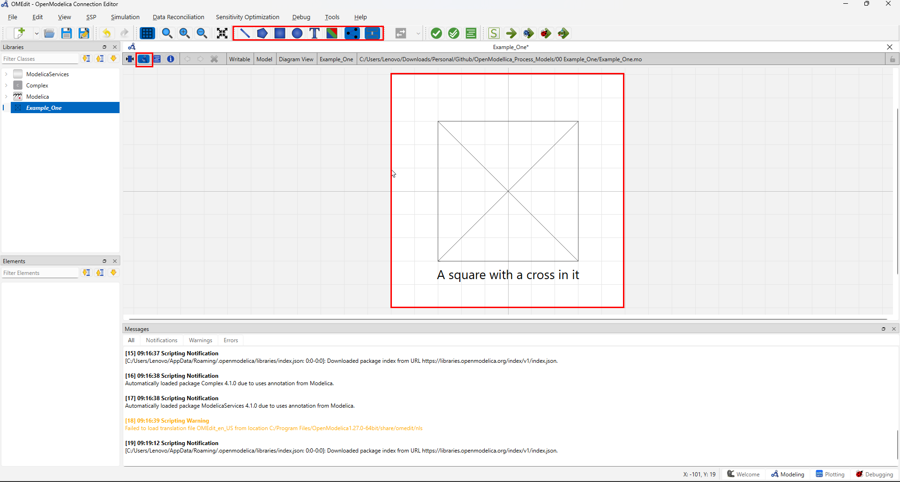
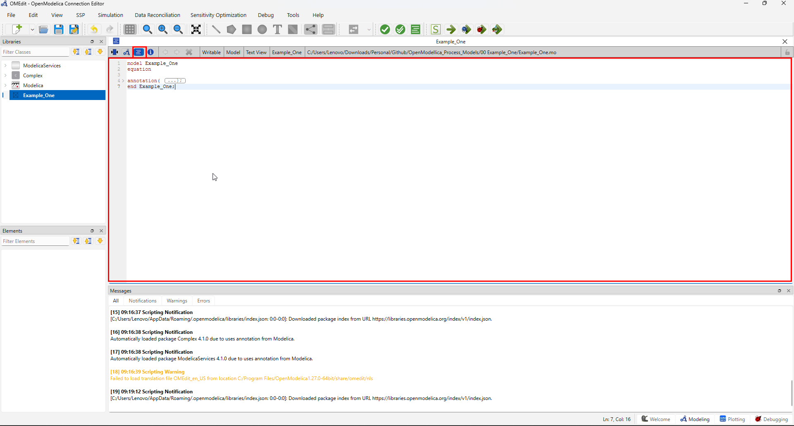
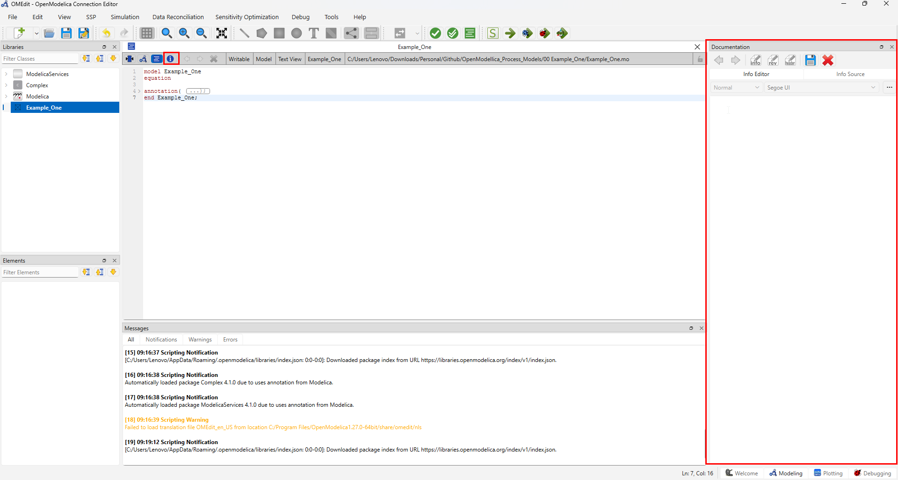

# Example One: Building a Dummy Model in OpenModelica

This document records the first model created while learning the OpenModelica
user interface and workflow. Screenshots has been added to the [`images`](./images/).

## 1. Purpose and learning goals

The purpose of this example is to become familiar with:

- opening OpenModelica and navigating the OMEdit interface;
- creating a new Modelica model and organizing it in a package;
- adding components from the Modelica Standard Library;
- connecting components and checking connector compatibility;
- entering parameter values and initial conditions;
- translating, simulating, and inspecting the results; and
- documenting a model so that it can be reproduced later.

This is a learning example rather than a production-ready process model.

## 2. Model overview

### Model name

`Example_One.mo`

### What the model represents

`Example_One` is a **dummy, non-physical model**. It exists only to practice
the OMEdit workflow end-to-end: drawing a custom icon (a square with a cross),
writing a minimal equation so the model has something to simulate, and running
it through check → translate → simulate → plot. It does not represent a real
process unit; the "square with a cross" is a generic placeholder icon, similar
to how a blank block is used in flowsheeting software before a real unit
operation is assigned to it.

A single dummy state variable with first-order decay dynamics
(`der(x) = -a*x`) is included specifically so the simulation and plotting
steps (Sections 9–10) have real data to work with, instead of an empty result.

### Inputs

| Input | Description | Value or unit |
| --- | --- | --- |
| `a` | Decay constant (parameter, not a real physical input) | `1 [1/s]` |

### Outputs

| Output | Description | Value or unit |
| --- | --- | --- |
| `x` | Dummy state variable, decays exponentially from its initial value | starts at `1`, dimensionless |

### Main assumptions

1. The model has no physical meaning — it is a syntax/workflow exercise only.
2. `x` is treated as a generic dimensionless quantity, not tied to any real unit or process variable.
3. The icon (square with a cross) is purely graphical and does not represent connector ports or physical boundaries.

## 3. Software and project setup

Record the environment used for this example:

- **OpenModelica version:** `V 1.27.0`
- **OMEdit version:** `V 1.27.0`
- **Operating system:** `Windows 11`
- **Date created:** `2026-08-28`
- **Modelica libraries used:** `None (Modelica Standard Library only, no components added)`

### Starting OpenModelica

1. Open OMEdit.
2. Understaing the basic UI elements like Libraries, Elements, Recent Files, Latest News & Events, Messages, Ribbon → File, Edit, View, SSP etc., And on the bottom right Welcome, Modelling, Plotting And Debugging
2. Confirm that the required Modelica libraries are available.
3. Create or open the package that will contain this example.
4. Save the package in the project directory.


## 4. Creating the model

1. Click on create a new modellica class or press 'CTRL+N'.
2. Once clicked a new window will appear where you will need to enter the model name Name it as `Example_One` and select the specification as `model`.
4. Once done click on OK.


## 5. Understanding the UI of Model `Example_One`

A new editing window will appear where certain type of different views will be available for example icon, diagram, text, documentaion

Each of these views has a differnt meaning to the model class
For example
1. Icon → Where you may design your own icon
2. Diagram → Very much similar to icon view but on holistic level
3. Text → Where the user can write the custom models
4. Documentation → As the name suggests used for documentation



### 5.1 Exploring all the components of views in detail
Icon view is used to create custom icons for your model. For example since out first model will draw a square with a cross in it. It can be used to create icon for the same. It just gives the user a preliminary idea of the model



**Diagram view** is easy to confuse with Icon view, since for this model they'll
end up looking similar. The distinction matters once your models get more
complex:

- **Icon view** defines how the model appears *as a single block* when it is
  dropped into a larger model — this is the small, simplified symbol other
  people see when reusing your component (comparable to the symbol a unit
  operation shows on a PFD).
- **Diagram view** defines what you see *inside* the model when you open it —
  this is where you place and connect sub-components (pumps, valves, other
  models) that make up this model internally, similar to opening a unit
  operation to see its internal wiring.

For `Example_One` there are no sub-components, so the diagram view is being
used here only to place the same square-and-cross graphic — but going forward,
Diagram view is where your actual connected flowsheets will live, while Icon
view stays reserved for the simplified block symbol.



**Text view** is used to write the model equations which will generate a square with cross in it . With the real values and so on. For a model with no
sub-components, the icon graphics and the equations both live directly in the
text view. The square-and-cross shape is produced by two graphical
primitives — a `Rectangle` and two diagonal `Line`s — placed inside an
`annotation(...)` block, while the actual simulatable behavior comes from a
separate `equation` section. These two things (graphics annotation vs.
equations) are unrelated to each other in Modelica: the annotation controls
only what you *see*, the equation section controls what the solver actually
*computes*.



As the name suggest used for documentation


## 7. Reviewing the generated Modelica code

Switch to the **Text View** and review the code generated from the diagram.
Check that:

- the `Rectangle` primitive draws the outer square (its `extent` sets the
  bottom-left and top-right corners);
- two `Line` primitives draw the diagonals of the cross, each running corner
  to corner;
- the `equation` section contains `der(x) = -a*x`, separate from the graphics;
- the `parameter Real a` and `Real x(start = 1)` declarations appear above the
  `equation` keyword, not inside the annotation.

Copy important observations here:

```modelica
model Example_One
  "Dummy model used to learn the OMEdit workflow: draws a square with a cross as its icon"

  parameter Real a = 1 "Decay constant, used only to exercise simulation";
  Real x(start = 1, fixed = true) "Dummy state variable with no physical meaning";

equation
  der(x) = -a * x;

  annotation(
    Icon(graphics = {
      Rectangle(extent = {{-100, -100}, {100, 100}}, lineColor = {0, 0, 0}, lineThickness = 0.5),
      Line(points = {{-100, -100}, {100, 100}}, color = {0, 0, 0}),
      Line(points = {{-100, 100}, {100, -100}}, color = {0, 0, 0})
    }),
    Diagram(graphics = {
      Rectangle(extent = {{-100, -100}, {100, 100}}, lineColor = {0, 0, 0}),
      Line(points = {{-100, -100}, {100, 100}}, color = {0, 0, 0}),
      Line(points = {{-100, 100}, {100, -100}}, color = {0, 0, 0})
    }),
    Documentation(info = "<html><p>Dummy model created while learning the OMEdit workflow. The icon is a square with a cross, drawn using basic graphical primitives. A single dummy state variable x with first-order decay dynamics (der(x) = -a*x) is included so the model can be checked, translated, and simulated end-to-end.</p></html>"),
    experiment(StartTime = 0, StopTime = 10, Tolerance = 1e-6, Interval = 0.02));
end Example_One;
```


## 8. Checking and translating the model

Before simulating:

1. Save the model.
2. Run **Check Model** or **Check All Models**.
3. Read every warning and error.
4. Resolve connector, parameter, or initialization problems.
5. Translate the model once the check completes successfully.

Record the result:

- **Check result:** `<successful / warnings / errors>`
- **Translation result:** `<successful / failed>`
- **Important messages:** `<paste or summarize messages>`


## 9. Configuring and running the simulation

Use the simulation setup dialog to record the settings used:

| Setting | Value |
| --- | --- |
| Start time | `0` |
| Stop time | `10` |
| Number of intervals | `500` |
| Solver | `dassl` (OpenModelica's default solver) |
| Tolerance | `1e-6` |
| Output format | `mat` |

These match the `experiment(...)` annotation already embedded in the code
above, so OMEdit should pre-fill this dialog automatically — confirm the
values match rather than re-entering them from scratch.

Then:

1. Apply the simulation settings.
2. Start the simulation.
3. Confirm that it completes without errors.
4. Save the model and simulation result.


## 10. Reviewing simulation results

Select the variables that are relevant to the model and inspect their plots.
Record what each plot demonstrates.
 
| Variable | Expected behavior | Observed behavior |
| --- | --- | --- |
| `x` | Starts at `1` and decays exponentially toward `0`, following `x(t) = x(0)*e^(-a*t)` since `a = 1` | Matches exactly: `x = 0.3679` at `t = 1` (expected `e^-1 = 0.3679`), and `x = 4.58e-5` at `t = 10` (expected `e^-10 = 4.54e-5`) |
| `der(x)` | Starts at `-1` and approaches `0` as `x` approaches `0` | Matches exactly: `der(x)` equals `-x` at every logged timestep, as required by `der(x) = -a*x` with `a = 1` |
 


 
### Result interpretation
 
The exported results follow textbook first-order exponential decay with no
numerical instability, oscillation, or unexpected jumps. `x` falls smoothly
from `1` toward `0`, crossing `0.368` at `t = 1` (one time constant, since
`τ = 1/a = 1`) and reaching effective steady state (`x < 0.001`) by around
`t = 7`. `der(x)` tracks `-x` at every timestep, confirming the equation is
being solved correctly rather than approximated. There is no transient
overshoot or settling behavior beyond the expected smooth decay, which is
consistent with this being a simple linear first-order ODE rather than a
more complex coupled system.
 
One point worth calling out explicitly for readers: **the plotted results
show only `x`, `der(x)`, and `a` — there is no "square" or "cross" anywhere
in the simulation output.** This is expected, not an error. The square-and-
cross shape exists purely in the model's `Icon` and `Diagram` annotations,
which control how the model *looks* when placed in OMEdit; it has no
connection to the `equation` section, which controls what actually gets
solved and plotted. In other words, this model has two completely
independent parts living in the same file: a cosmetic icon (square with a
cross) and a numeric behavior (exponential decay). Simulating the model
will only ever exercise the second part.


## 11. Problems encountered and fixes

| Problem | Likely cause | Fix |
| --- | --- | --- |
| `<problem>` | `<cause>` | `<fix>` |
| `<problem>` | `<cause>` | `<fix>` |

## 12. Reproduction checklist

- [ ] Open the recorded OpenModelica version.
- [ ] Open the package containing the example.
- [ ] Confirm that all referenced libraries are available.
- [ ] Confirm component names and parameter values.
- [ ] Confirm all connections.
- [ ] Check and translate the model.
- [ ] Run the simulation with the recorded settings.
- [ ] Compare the results with the observations in this document.
- [ ] Add or update screenshots when the model changes.

## 13. Next steps

- Replace the dummy components with the intended process components.
- Add realistic parameters and units.
- Add validation cases and expected results.
- Improve the diagram layout and annotations.
- Document assumptions and limitations before reusing the model.